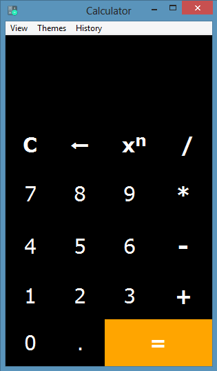
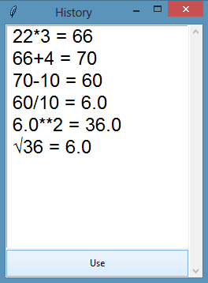

# Python GUI Calculator

This is a **Simple GUI Scientific Calculator** based on python's inbuilt GUI module Tkinter. I did this work inspired by the Python coding challenge hosted by [Crossroads](https://www.youtube.com/channel/UCoGHeFY7jE2OB_TJS_87MOA "Best Programming Based Malayalam Tutorial Channel") youtube channel. Other than normal calculator functions, I have added many features and some are in beta stage.

## Key Features

* Scientific Mode with **Inverse** Function
* Themes
* History with Use History feature

## Screenshots

##### Themes
  

##### Scientific Mode
 

##### History

---

## Future updates

* Multiline Complex Calculations.
* Unit converter.
* Currency Converter.
* Voice and Gesture Input.

> Feel free to Collaborate,Contribute on this work. Post issues if there any. Give a star if you like my work.